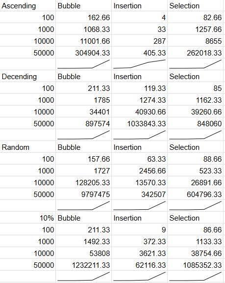

# Exploring Sorting Runtimes

Sorting algorithms can be analyzed based on their time complexity and specific characteristics. Bubble sort, insertion sort, and selection sort all share a worst-case time complexity of O(n²), making them inefficient for large datasets. However, their simplicity and ease of implementation make them suitable for smaller datasets or specific scenarios.

## Algorithm Overview

### Bubble Sort
Bubble sort repeatedly compares and swaps adjacent elements if they are in the wrong order. While simple, it involves a high number of swaps:
- **Best Case**: O(n), when the array is already sorted.
- **Average Case**: O(n²).

### Insertion Sort
Insertion sort builds a sorted array incrementally by placing each element in its correct position. It is particularly efficient for nearly sorted data:
- **Best Case**: O(n), when the array is nearly sorted.
- **Average Case**: O(n²).

### Selection Sort
Selection sort repeatedly selects the smallest element from the unsorted portion and swaps it with the first unsorted element. It performs fewer swaps compared to bubble sort:
- **Best Case**: O(n²), as it always scans the entire unsorted portion.
- **Average Case**: O(n²).

## Use Cases and Advantages

Despite their quadratic time complexity, these algorithms have unique strengths that make them useful in specific contexts:

- **Bubble Sort**: Ideal for educational purposes due to its simplicity, helping learners grasp the fundamentals of sorting. It is also effective for small, nearly sorted datasets, where it can quickly resolve minor discrepancies.
  
- **Insertion Sort**: Excels in scenarios where the dataset is partially sorted or when new elements are frequently added to a sorted list. Its adaptive nature allows it to perform efficiently in such cases.
  
- **Selection Sort**: While less efficient overall, its predictable number of swaps makes it suitable for situations where minimizing write operations is critical, such as when working with limited memory or storage devices with high write costs.

